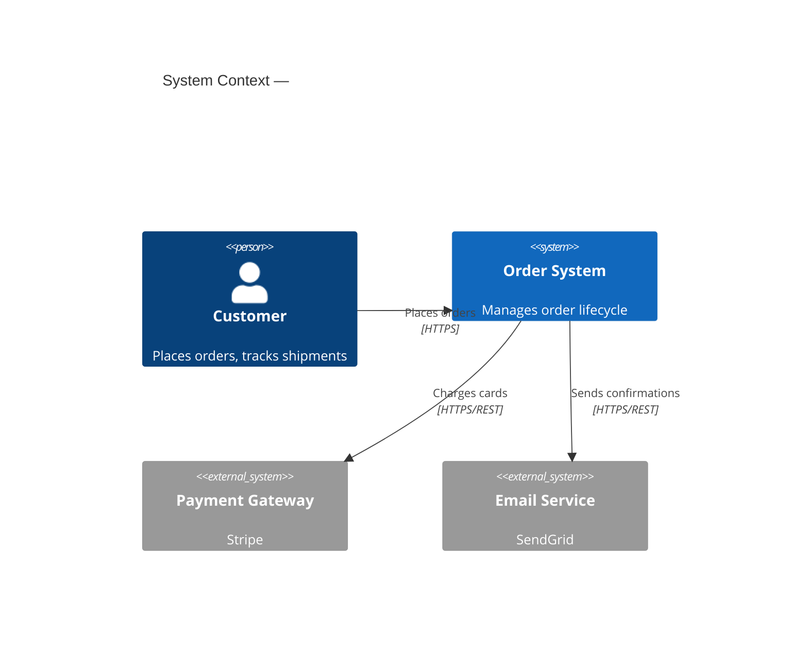
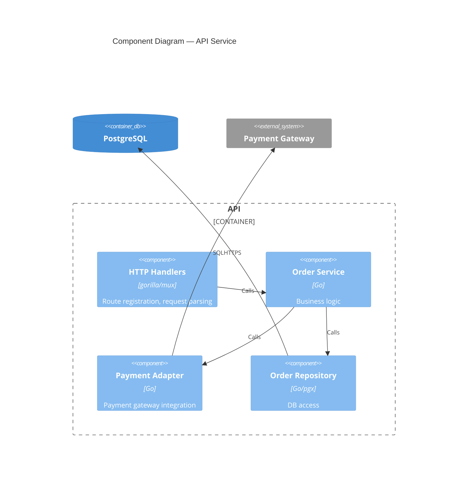

## Overview

The C4 model describes software architecture at four levels of zoom. For domain modeling, produce Level 1 (Context) and Level 2 (Container). Level 3 (Component) is optional and only needed for complex services.

C4 is best for: documenting system boundaries, integration points, and technology choices. Pair with `ddd` or `event-storming` for internal domain structure.

## Level 1 — System Context

Shows the system, its users, and the external systems it interacts with.



## Level 2 — Container

Shows the deployable units (services, databases, frontends) inside the system boundary.

```mermaid
C4Container
    title Container Diagram — <System Name>

    Person(user, "Customer")
    System_Boundary(orderSystem, "Order System") {
        Container(webApp, "Web App", "React/TypeScript", "Order placement UI")
        Container(api, "API", "Go/gorilla-mux", "Order management REST API")
        ContainerDb(db, "Database", "PostgreSQL", "Orders, customers, products")
        Container(worker, "Worker", "Go", "Async order processing")
    }
    System_Ext(paymentGateway, "Payment Gateway")
    Queue(queue, "SQS Queue", "Order events")

    Rel(user, webApp, "Uses", "HTTPS")
    Rel(webApp, api, "Calls", "HTTPS/REST")
    Rel(api, db, "Reads/writes", "pgx")
    Rel(api, queue, "Publishes events", "AWS SDK")
    Rel(worker, queue, "Consumes events", "AWS SDK")
    Rel(worker, paymentGateway, "Charges", "HTTPS")
```

## Level 3 — Component (optional)

Only draw Level 3 for services with complex internal structure. Shows the components inside one container.



## SME questions (batch 3–5 per round)

```
SME QUESTIONS — C4 Session (round N):
1. <question about external system or integration>
2. <question about deployment boundary>
3. <question about user type or persona>
AWAITING SME RESPONSE
```

## Output

Save diagrams as:
- `designs/DMD/<service>-c4-context.mmd` — Level 1
- `designs/DMD/<service>-c4-container.mmd` — Level 2
- `designs/DMD/<service>-c4-component.mmd` — Level 3 (if applicable)

Include a `<service>-domain.md` with a brief prose description of each container and its responsibilities.
