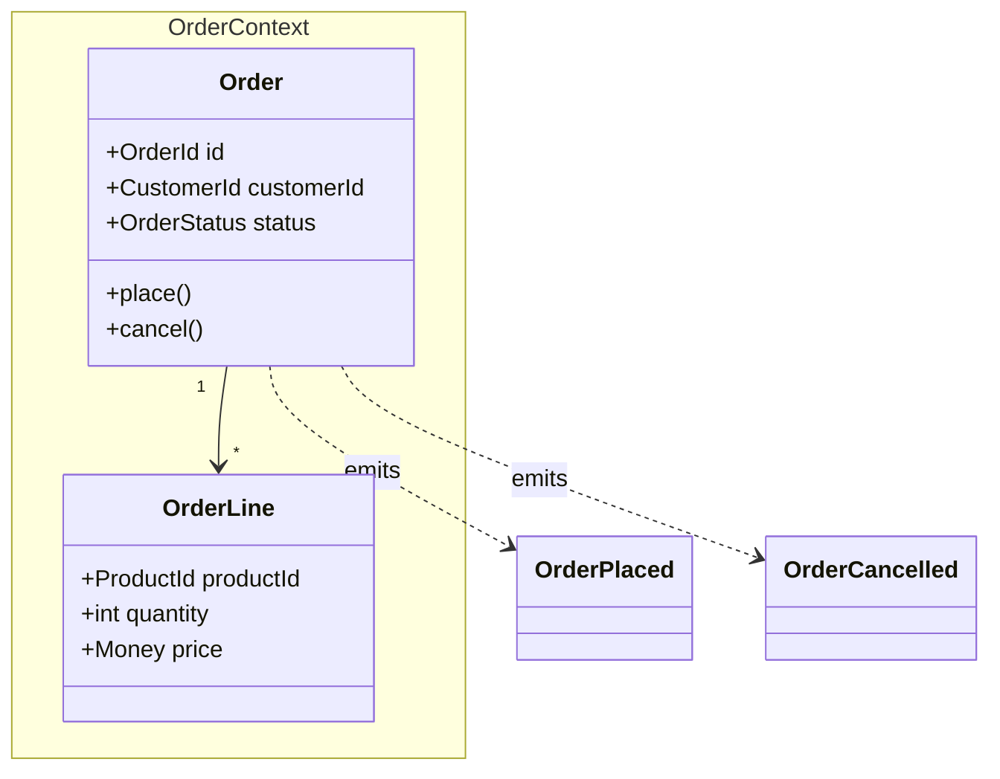

## Overview

DDD produces a structured domain model in a single architect-led session. No multi-phase flow discovery — the architect builds the model top-down from requirements. Best for: well-understood domains, greenfield services, or when stakeholders can articulate the domain clearly upfront.

For complex or poorly-understood domains, prefer `event-storming` methodology.

## Steps

1. **Identify bounded contexts** — name the scoped parts of the domain with their own language. Look for: different teams, different data lifecycles, places where the same word means different things.
2. **Define aggregates** per context — clusters of entities treated as one unit for consistency.
3. **Define entities and value objects** — entities have identity; value objects are immutable and defined by their attributes.
4. **Define domain events** — what are the important things that happen in this domain?
5. **Define domain services** — logic that spans multiple aggregates and doesn't fit in one.
6. **Define repository interfaces** — one per aggregate root; implementation lives in infrastructure.
7. **Build ubiquitous language** — one term per concept per bounded context.

## SME questions (batch 3–5 per round)

```
SME QUESTIONS — DDD Session (round N):
1. <question about business concept or rule>
2. <question about ownership or consistency boundary>
3. <question about term clarification>
AWAITING SME RESPONSE
```

## Output format

Produce a structured domain model in this format:

```
DOMAIN MODEL: <Service/System Name>
=====================================

## Bounded Contexts

### <Context Name>
Description: <what this context owns>
Core domain: [yes|no]

#### Aggregates
- **<AggregateName>** (root: <RootEntityName>)
  - Entities: <EntityA>, <EntityB>
  - Value objects: <ValueObjectA>
  - Invariants: <business rule that must always hold>
  - Domain events: <EventA>, <EventB>

#### Domain Services
- <ServiceName>: <what it does and why it doesn't belong in an aggregate>

#### Repository Interfaces
- <RepositoryName>: find_by_id(), save(), [other methods]

## Ubiquitous Language

| Term | Definition | Bounded Context |
|------|-----------|----------------|
| <Term> | <definition in business language> | <Context> |

DOMAIN MODEL COMPLETE
```

## Mermaid diagram format



Output the diagram in a fenced `mermaid` code block. Save as `<service>-diagram.mmd`.
