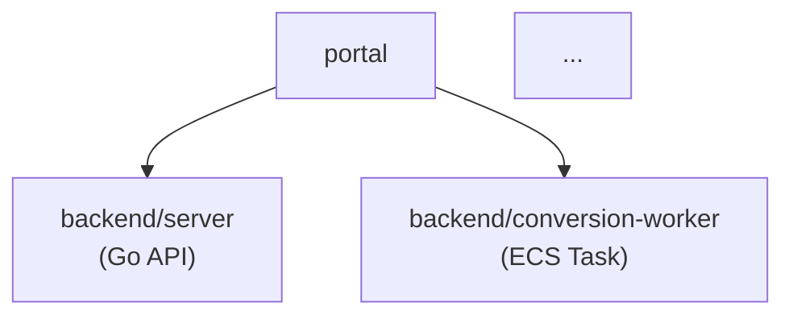

## Problem

The `/explore` Phase 1 Python scan identifies "service directories" by a crude heuristic:
any top-level directory containing at least one source file. This produces false positives
(`demo`, `integration`, `ops`, `panome`) and misses the decomposition opportunity for
large monolithic services (`portal`, `attestation`) that contain multiple independently
deployable binaries or business domains.

The correct decomposition view is described in the system SAD (decomposition diagram) and
is the reference architecture for OTM scope decisions. We should generate an equivalent
diagram, not just a flat service list.

## Forces

- Python can detect strong structural signals (separate `cmd/*` binaries, infra modules,
  git submodules) without reading source
- The infra directory is already located by Phase 1 (`terraform_info["root"]`) — we must
  not hardcode `ops/` or any project-specific path
- Many CI/CD codebases are a single large file, not modular — programmatic parsing is
  fragile; LLM reading a flat file listing is more robust
- The decomposition view must feed downstream tasks (summaries, OTM scope) — it is a
  gating step, not a post-processing step

## Decision

Add a new **Phase 2a: Decomposition Synthesis** step that runs between the component
inventory scan and the per-service summarisation loop. It is a single no-tools LLM call
that takes Python-assembled context and produces:

1. `REAL_SERVICE:` — confirmed deployable services
2. `NOT_SERVICE:` — excluded candidates with reason
3. `DECOMPOSE:` — large services with their logical sub-services
4. A Mermaid `graph TD` decomposition diagram written to `structure.md`

## Signal hierarchy (Python → LLM)

The Python scan provides signals in descending reliability order:

| Signal | How detected | What it implies |
|--------|-------------|-----------------|
| sub-executable | `cmd/*/main.go`, `bin/`, `[[bin]]` | Separately compiled binary = real deployable |
| infra module | matching dir in `terraform_info["modules_path"]` | Separately provisioned infra = separate service |
| git submodule | `.gitmodules` entry | Managed as separate repo = separate component |
| top-level dir with source | Phase 1 heuristic | Candidate only — LLM must verify |

A candidate with **no sub-executable AND no infra module** whose name matches
`demo|integration|bdd|test|tools|scripts|docs` is almost certainly not a service.

A candidate with **2+ sub-executables of different roles** (e.g. `server` + `worker` +
`entrypoint` in attestation; 17 `cmd/*` in portal) should be **decomposed**.

## Infra context (no hardcoding)

The infra directory is `terraform_info["root"]` — already a string relative path detected
in Phase 1. Python lists its immediate files and first-level subdirs (not recursive, not
parsed) and passes this as a flat file listing to the LLM. The LLM infers deployment
topology from filenames without us parsing CI/CD or Terraform syntax.

If `terraform_info` is absent (no infra detected), infra context is omitted — the LLM
works from sub-executables and git submodules alone.

## SAD reference

If `designs/SAD/` exists (auto-detected via `designs_dir`), Python pre-reads the first
~1500 chars of each SAD file and includes it as context. The LLM uses the SAD decomposition
description to align its output with the project's intended architecture.

The designs path is always resolved from config (`designs.path`) or auto-detected —
never hardcoded.

## Output

### Structured lines (machine-parsed)
```
REAL_SERVICE: portal/backend | Go API server with multiple workers — 17 cmd/* binaries
NOT_SERVICE: demo | Playwright demo script, not a deployable service
DECOMPOSE: portal/backend → server, conversion-worker, dataset-worker, duo-ingest | distinct ECS tasks in ops/ecs
DECOMPOSE: attestation → server, worker, entrypoint, pipeline-sfn | 4 separately deployed binaries
```

### Decomposition diagram (written to structure.md)
```
DECOMPOSITION_BEGIN

DECOMPOSITION_END
```

## Effect on downstream phases

- Phase 2 summarise loop uses `real_services` (not raw `svc_dirs_scan`)
- Decomposed sub-services get their own summary call with parent context injected
- OTM scope uses `real_services` + decomposed sub-services as candidates
- `component_summaries` in inventory.json keyed by logical service name

## What this does NOT do

- No parsing of Terraform HCL, CI/CD YAML, or Docker files
- No recursive directory walk of infra dir
- No hardcoded directory names (`ops/`, `portal/`, `fhir_proxy/`)
- Does not replace the Phase 1 Python scan — Python still provides candidates
