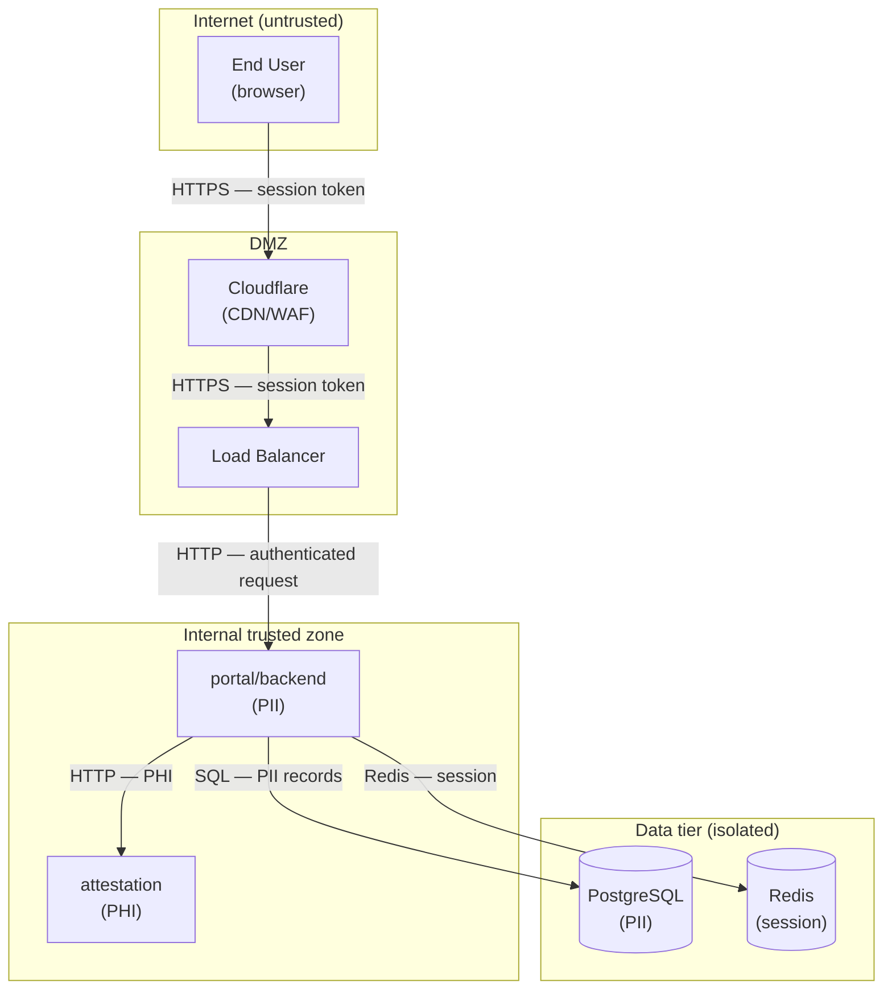

## Purpose

`/threat` generates a structured threat model for each deployable service in the
codebase. It produces OTM YAML files (one per service or project group) and exports
to the configured threat modeling tool (Threat Dragon, IriusRisk, Microsoft TMMT).

The command builds on `/explore` outputs — it does not re-survey the codebase.
The decomposition diagram, deployment diagram, network diagram, and architectural DFD
produced by `/explore` Phase 5 are the structural inputs. `/threat` adds the security
layer: trust boundaries, sensitive data flow labels, STRIDE/LINDDUN threat
identification, and mitigations.

---

## Pre-condition: /explore outputs

`/threat` requires these `.code-crew/` files (written by `/explore`):

| File | Used for |
|------|----------|
| `structure.md` | Service summaries, sensitivity labels, compliance context |
| `decomposition.md` | Service topology (base for threat DFD) |
| `deployment.md` | Compute platform context (ECS, Lambda, etc.) |
| `network.md` | Network topology (subnets, trust zones, ingress paths) |
| `dataflow.md` | Architectural DFD — service-to-service connections |
| `inventory.json` | Project list, stacks, external services |

If any Phase 5 file is missing (e.g. old `/explore` run before ADD-013 Phase 5),
the command warns and continues — missing diagrams reduce context but don't block.

---

## Full flow

```
Phase 0 — Threat DFD annotation          (1 LLM call — Security Lead)
│   Input:  dataflow.md + network.md + decomposition.md + structure.md
│   Output: threat_dfd.md (trust boundaries + sensitivity labels on the DFD)
│
Phase 1 — Discovery                       (1 LLM call — Architect)
│   Input:  threat_dfd.md + deployment.md + structure.md
│   Output: trust zones + component inventory (YAML)
│
Phase 2 — Per-component threat analysis   (N parallel LLM calls — Security Lead)
│   Input:  component + trust_dfd.md + structure.md section
│   Output: threats YAML per component
│
Phase 3 — Per-component mitigations       (N parallel LLM calls — Security Lead)
│   Input:  component + threats from Phase 2
│   Output: mitigations YAML per component
│
Assembly — Python                         (no LLM)
│   Renumber T-NNN / M-NNN IDs; merge into OTM YAML; write to disk
│
Refinement passes × max_refine_passes     (1 LLM call per pass — Security Lead)
│   Input:  complete assembled OTM
│   Output: additional_threats + additional_mitigations
│   Stops early on "NO NEW THREATS" signal
│
Gate                                      (1 LLM call — Manager)
    Input:  final OTM
    THREAT MODEL APPROVED → export artifacts
    NEEDS REVISION → threat_patch → re-gate (max retry loop)
```

---

## Phase 0 — Threat DFD annotation

**Problem**: The architectural DFD from `/explore` (`dataflow.md`) shows data flows
but has no security annotations. The threat model needs:
- Trust boundaries (where authentication/authorisation decisions happen)
- Data sensitivity labels on flows (PHI, PII, internal, public)
- External entity classification (internet user, internal service, third-party API)
- Data store sensitivity (encrypted-at-rest, sensitive, public)

**Approach**: One Security Lead LLM call that reads `dataflow.md`, `network.md`,
`decomposition.md`, and the sensitivity fields from `structure.md` UNIT_SUMMARY
blocks. It outputs `threat_dfd.md` — the architectural DFD annotated with trust
boundaries and sensitivity labels.

**Input context injected**:
```
## Architectural data flow (from /explore)
<contents of dataflow.md>

## Network topology (from /explore)
<contents of network.md>

## Service decomposition (from /explore)
<mermaid block from decomposition.md>

## Service sensitivity labels (from structure.md)
<SENSITIVITY field from each UNIT_SUMMARY>
```

**Output** (`threat_dfd.md`):



`threat_dfd.md` is written to `.code-crew/` and used as the primary context for
Phases 1–3. It does not need to be regenerated if already present — `/threat dfd`
forces a refresh.

**Design note — architectural vs. threat DFD**: The architectural DFD (`dataflow.md`)
is generated by `/explore` without security knowledge, using `CONNECTS_TO` fields
from code analysis. It shows structural connections. The threat DFD (`threat_dfd.md`)
adds the security perspective: trust zone placement, data classification, and the
semantics of each boundary crossing. These are deliberately separate artifacts.
An architectural change (new service added) triggers `/explore` re-run.
A security reclassification (service re-scoped from public to PHI) triggers
`/threat dfd` refresh without re-running explore.

---

## Phase 1 — Discovery

**Agent**: Architect  
**Task**: `threat_discover`  
**Input**: `threat_dfd.md`, `deployment.md`, `structure.md`

Produces the OTM skeleton:
- `trustZones` — one per subgraph in the threat DFD
- `components` — one per deployable service / data store / external entity
- `dataflows` — one per labelled arrow in the threat DFD
- `assets` — inferred from sensitivity labels (PHI records, session tokens, etc.)

This is a **discovery** step, not a threat identification step. The output is
structured YAML that seeds the per-component analysis.

---

## Phase 2 — Per-component threat analysis *(parallel, ADD-009)*

**Agent**: Security Lead  
**Task**: `threat_component_threats` (one call per component)

Each call receives:
- The component's OTM entry (from Phase 1)
- The component's `UNIT_SUMMARY` block from `structure.md`
- The threat DFD section showing flows into/out of this component
- The trust zone it belongs to

Output: `threats:` YAML for this component following STRIDE + applicable frameworks
(LINDDUN for PHI/PII components, DIE for ECS/Lambda, PLOT4ai for AI/LLM components).

Runs in parallel (asyncio) per ADD-009. Component batch size is bounded to avoid
504 timeouts per ADD-008.

---

## Phase 3 — Per-component mitigations *(parallel, ADD-009)*

**Agent**: Security Lead  
**Task**: `threat_component_threats` → `threat_mitigations`

Each call receives the component's threats from Phase 2 and outputs `mitigations:`
YAML. Runs in parallel with the same batching as Phase 2.

---

## Assembly *(Python, no LLM)*

Python:
1. Collects all per-component threat and mitigation YAML
2. Renumbers `T-NNN` and `M-NNN` IDs sequentially across components
3. Updates all cross-references (`mitigatedThreats`, `targetedComponents`)
4. Builds the complete OTM YAML structure
5. Writes to `designs/TMD/<project>.otm.yaml`

---

## Refinement passes *(ADD-011)*

See ADD-011 for full design. Summary:
- Up to `threat.max_refine_passes` passes (default: 2)
- Each pass reads the complete assembled OTM and outputs only additions
- Targets: zone-boundary crossing threats, threat chaining, compound framework gaps
- Stops early on `NO NEW THREATS` signal
- Python merges additions (ID continuation, not restart)

---

## Gate and patch loop

**Agent**: Manager  
**Task**: `threat_gate`

Reads the final OTM and checks:
- Every trust boundary crossing has at least one threat
- LINDDUN coverage for PHI/PII components
- DIE coverage for ECS/Lambda components
- All `targetedComponents` and `targetedAssets` IDs resolve

**THREAT MODEL APPROVED** → export artifacts  
**NEEDS REVISION** → `threat_patch` (Security Lead reads gate feedback, adds missing
items) → re-gate. Max retries from `flow.max_retries` config.

---

## Export artifacts

| Artifact | Path | Tool |
|----------|------|------|
| OTM YAML | `designs/TMD/<project>.otm.yaml` | Native (OpenThreatModel) |
| Threat Dragon JSON | `designs/TMD/<project>.td.json` | `threat-dragon` config |
| IriusRisk XML | `designs/TMD/<project>.ir.xml` | `irius-risk` config |
| TMMT CSV | `designs/TMD/<project>.tmmt.csv` | `microsoft-tmmt` config |

Export format is configured via `threat_modeling.tool` in `~/.code-crew/config.yaml`.

---

## `/threat` sub-commands

| Command | Behaviour |
|---------|-----------|
| `/threat` | Full run — all phases from Phase 0 |
| `/threat dfd` | Phase 0 only — regenerate `threat_dfd.md` without re-running threat analysis |
| `/threat refine [N]` | N additional refinement passes on existing OTM (no re-discovery) |
| `/threat <project>` | Run for a specific OTM project only |

---

## Context injection strategy

`_build_threat_context()` injects into every threat agent call:

```python
ctx = []
ctx += _load_structure_sections(*STRUCTURE_SECURITY)   # Security-relevant sections only
ctx += _load_decomposition_diagram()                   # Compact mermaid block
ctx += _load_diagram("threat_dfd.md")                  # Trust boundary diagram
ctx += _load_diagram("deployment.md")                  # Compute context
# network.md injected in Phase 0 only (large; not needed per-component)
# dataflow.md replaced by threat_dfd.md for Phase 1+
```

Per-component calls additionally receive the component's own UNIT_SUMMARY and the
threat DFD sub-graph for that component's zone.

---

## Agent / task mapping

| Phase | Agent | Task file |
|-------|-------|-----------|
| 0 | Security Lead | `threat_model.md` (new: DFD annotation section) |
| 1 | Architect | `threat_discover.md` |
| 2 | Security Lead | `threat_component_threats.md` |
| 3 | Security Lead | `threat_mitigations.md` |
| Refinement | Security Lead | `threat_refine.md` |
| Gate | Manager | `threat_gate.md` |
| Patch | Security Lead | `threat_patch.md` |

---

## Key constraints

- `/threat` never pushes to git, applies Terraform, or promotes to production
- OTM files in `designs/TMD/` are for human review before any toolchain import
- PHI/PII data appearing in threat model context (service summaries) is description
  only — no actual sensitive data is read or logged
- The threat DFD (`threat_dfd.md`) is a local cache — it is not committed to the
  platform repo automatically
