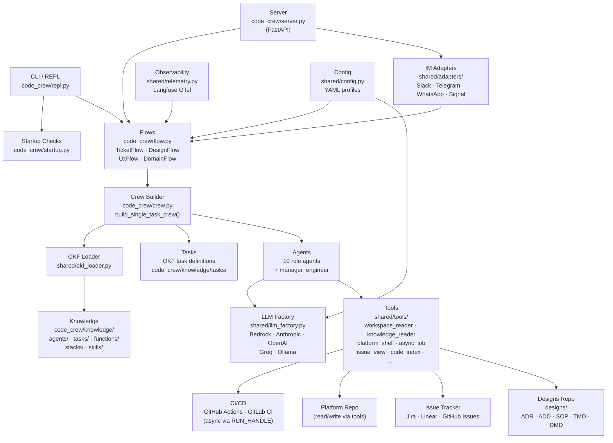
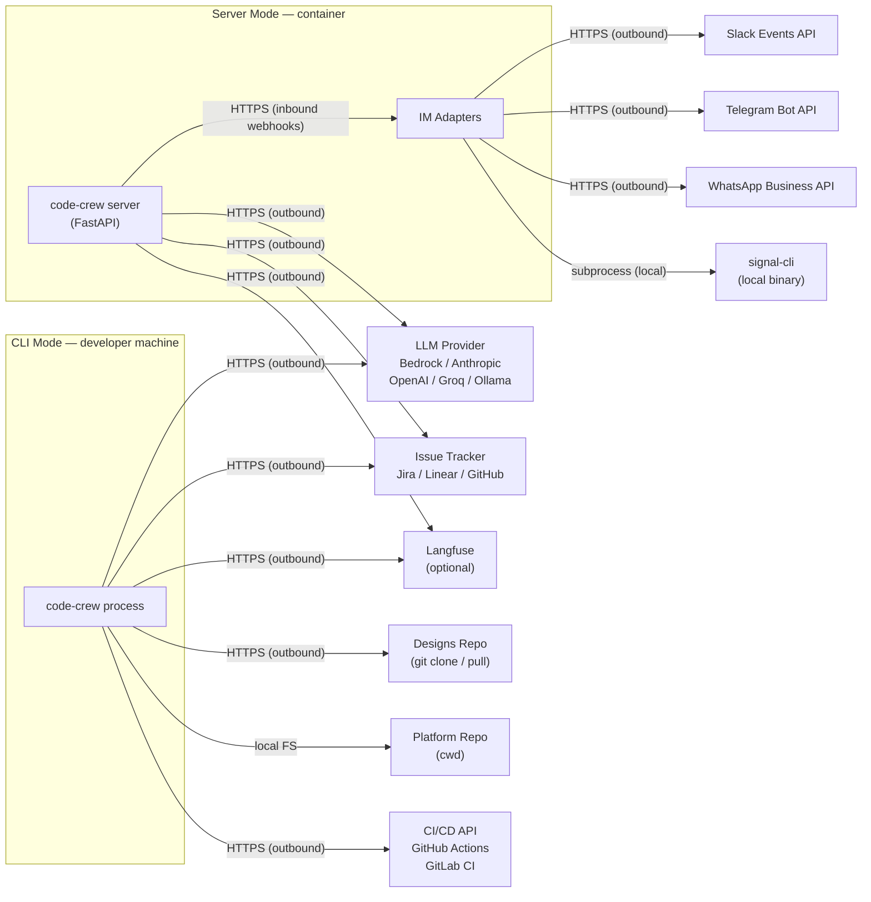
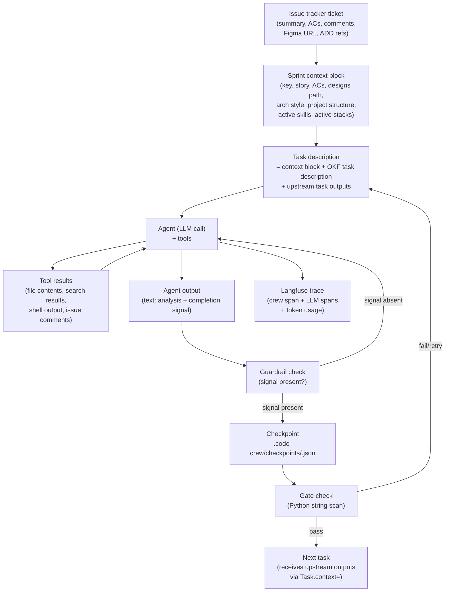
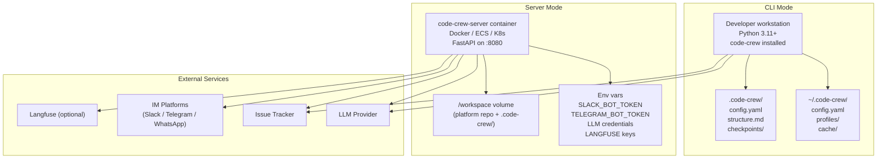
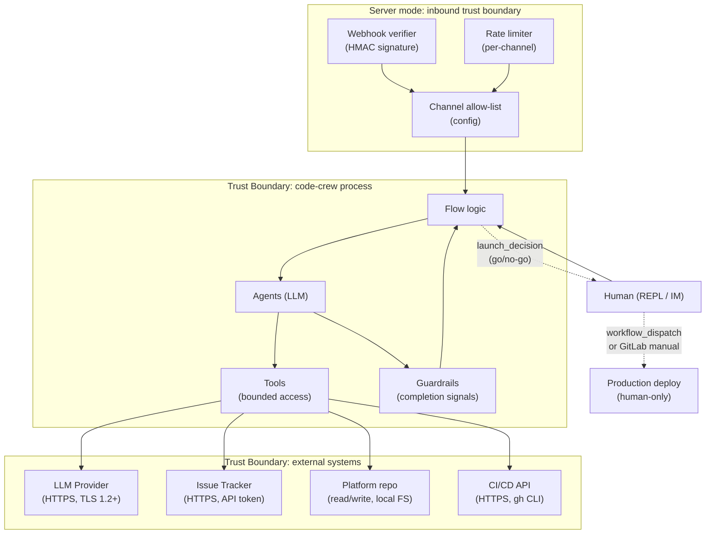

# SAD-001: code-crew System Architecture Document

**Status:** Current  
**Version:** 2.0  
**Date:** 2026-07-03  
**Related:**
- [ADD-001: Virtual AI Development Team Design](../add/ADD-001-Virtual-AI-Development-Team.md)
- [ADD-006: OKF Knowledge Architecture](../add/ADD-006-OKF-Knowledge-Architecture.md)
- [ADD-007: Server Mode and IM Adapters](../add/ADD-007-Server-Mode-IM-Adapters.md)
- [ADR-001: CrewAI Multi-Agent Architecture](../adr/ADR-001-CrewAI-Multi-Agent-Architecture.md)
- [ADR-006: Manager-Worker Execution Model](../adr/ADR-006-Manager-Worker-Execution-Model.md)
- [ADR-007: Python Flow Orchestration](../adr/ADR-007-Python-Flow-Orchestration.md)
- [ADR-008: Server Mode with IM Adapter Layer](../adr/ADR-008-Server-Mode-IM-Adapters.md)

---

## 1. Introduction

### 1.1 Purpose

This document is the authoritative architecture reference for **code-crew** — a virtual AI development team that drives software tickets through a full SDLC pipeline using a crew of purpose-built AI agents. It describes the system's structure, component responsibilities, data flows, deployment topology, and security controls across all execution modes.

When this document disagrees with the codebase, this document is wrong and must be updated. ADRs record the decisions that produced this architecture; ADDs expand on specific components with implementation detail. Neither replaces this document.

### 1.2 Quality Goals

| Priority | Quality Goal | Rationale |
|----------|-------------|-----------|
| 1 | **Correctness** | Agent output is used to produce code, tests, and design documents that teams act on. Incorrect output has downstream cost. |
| 2 | **Auditability** | Every agent action, LLM call, and gate decision must be traceable. Teams need to understand why an output was produced. |
| 3 | **Human control** | No agent can autonomously merge code, apply infrastructure changes, or promote to production. Every irreversible action requires a human gate. |
| 4 | **Extensibility** | New agent roles, IM platforms, LLM providers, and SDLC task sequences must be addable without modifying Python core. |
| 5 | **Availability (server mode)** | In server mode, the service must handle concurrent flows across multiple IM channels without one flow blocking another. |

### 1.3 Stakeholders

| Stakeholder | Interest |
|-------------|---------|
| Engineering team members | Trigger flows, receive updates, provide human gate decisions via CLI or IM |
| Architects | Review and approve design outputs (ADR/ADD drafts, architecture review task output) |
| Security leads | Review threat models and security gate output |
| Compliance officers | Review compliance gate findings |
| Product owners | Review BDD scenarios and sprint planning output |
| DevOps leads | Manage server mode deployment; monitor flow health |
| Tool operators | Configure LLM backends, IM adapters, profiles |

### 1.4 Value Proposition

code-crew compresses the most time-intensive phases of an SDLC (requirements → design → test authoring → implementation → review → staging) into a pipeline where AI agents produce first drafts and humans review, approve, and correct. The human is always in the loop at gate points; agents handle the mechanical, repeatable work between gates.

In server mode, the pipeline runs as a team-shared service: any team member can trigger, observe, or unblock a flow from their existing IM tool, without a developer keeping a terminal open.

---

## 2. System Overview

### 2.1 Technology Choices

| Layer | Technology | Rationale |
|-------|-----------|-----------|
| Agent orchestration | CrewAI | Role-based agents, hierarchical crew, task dependency graph, guardrails |
| LLM access | LiteLLM (multi-provider) | Bedrock, Anthropic, OpenAI, Groq, Ollama via unified interface; see ADR-001 |
| Flow orchestration | Python (`flow.py`) | Deterministic phase sequence; LLM cannot skip gates; see ADR-007 |
| Knowledge format | OKF (YAML frontmatter + markdown) | Human-readable; git-diffable; domain experts edit without Python; see ADD-006 |
| CLI/REPL | prompt_toolkit + Rich | Terminal UI; streaming output; slash command dispatch |
| Server mode | FastAPI + asyncio | Webhook handling; concurrent flows; IM adapter dispatch |
| Observability | Langfuse (OTel SDK) | Crew/task/LLM span hierarchy; optional; see ADR-005 |
| State persistence | JSON files (`.code-crew/`) | Checkpoints, flow state, structure cache — no database required for CLI mode |

### 2.2 Execution Modes

| Mode | Entry Point | Use Case |
|------|-------------|---------|
| **CLI** | `code-crew` → REPL → slash commands | Individual developer running flows locally |
| **Direct CLI** | `code-crew issue PROJ-123` | Scripted/CI invocation |
| **Server** | `code-crew server` | Team-shared service; IM-triggered flows |

All three modes share the same `TicketFlow`, `DesignFlow`, crew builder, and agent definitions. The execution mode changes how commands arrive and how output is delivered, not what the pipeline does.

### 2.3 Agent Roster

| Agent | Model Tier | Primary Responsibilities |
|-------|-----------|------------------------|
| `scrum_master` | fast | Sprint planning check, DoD enforcement, audit report |
| `architect` | powerful | Architecture review, code review, design docs, domain modeling, audit scans |
| `engineer` | standard | Scaffold, implementation, UX implementation, domain extract |
| `qa_lead` | standard | BDD authoring, test scaffolding, staging verification, smoke test |
| `product_owner` | standard | BDD business language review |
| `security_lead` | powerful | Security review, threat modeling (manager role), security audit scan |
| `compliance_officer` | standard | Compliance review, compliance audit scan |
| `devops_lead` | standard | DevOps coordination, staging promotion |
| `release_engineer` | standard | Release notes, launch decision |
| `ux_lead` | standard | Figma spec extraction, UX review |
| `manager_engineer` | fast / standard | Manager in hierarchical crews — drives worker to completion |

All agent definitions live in `code_crew/knowledge/agents/` as OKF markdown files. Python never contains a prompt.

### 2.4 User Journeys

**Developer — CLI mode:**
1. `code-crew init` → configure project, detect stacks
2. `code-crew explore` → scan codebase, write `.code-crew/structure.md`, generate OTM skeleton
3. `code-crew design PROJ-42` → architect produces ADD/ADR/TMD stub; Chief Architect approves
4. `code-crew issue PROJ-42` → full SDLC pipeline; developer reviews gate outputs, provides `/feedback` when stuck
5. Human triggers production deploy after `launch_decision` go

**Team — server mode:**
1. DevOps deploys `code-crew server` container with IM adapter config
2. Engineer types `/issue PROJ-42` in `#engineering` Slack channel
3. Bot posts task progress updates to the channel
4. On BDD review gate: bot posts "BDD scenarios ready for review — reply with `/feedback` to approve or request changes"
5. Product owner replies `/feedback looks good, approve`
6. Flow continues through implementation → staging → launch decision
7. Release engineer posts production deploy confirmation in channel

### 2.5 Key Domain Concepts

| Concept | Definition |
|---------|-----------|
| **Flow** | A Python class (`TicketFlow`, `DesignFlow`, etc.) that owns the SDLC phase sequence for one ticket/request |
| **Task** | A single SDLC phase executed as one CrewAI `Crew` run (one or more LLM calls) |
| **Gate** | A task output that Python checks for a signal (`REJECTED`, `BDD APPROVED`, etc.) to decide whether to retry or proceed |
| **Crew** | A CrewAI `Crew` instance: one or more agents + one or more tasks + a process (sequential or hierarchical) |
| **OKF** | Open Knowledge Format — YAML frontmatter + markdown body; the format for all agent/task/function knowledge files |
| **Adapter** | A `shared/adapters/` class that translates between an IM platform's wire format and the internal `Command`/`IMMessage` types |
| **Channel context** | The `(platform, channel_id)` key that identifies a flow in server mode; maps to checkpoint namespace and asyncio task |

---

## 3. Decomposition View

### 3.1 Context

This view answers: what are the major components of code-crew, what does each do, and how do they depend on each other? It covers both CLI and server execution modes.

### 3.2 Overview



### 3.3 Ticket Flow — Components Involved

`/issue <KEY>` or `/sprint <name>` activates the ticket flow path:

1. **REPL / Server adapter** receives the command and resolves the issue tracker key.
2. **`IssueViewTool`** (`shared/tools/issue_view.py`) fetches the ticket (summary, description, ACs, linked docs, Figma URL, comments) from the configured issue tracker.
3. **`TicketFlow`** (`code_crew/flow.py`) owns the phase sequence. It calls `build_single_task_crew(task_name, sprint_input)` for each of 19 tasks.
4. **`crew.py`** (`build_single_task_crew`) loads agent and task definitions from OKF, assembles a `Crew` with the correct process (sequential or hierarchical), and returns it.
5. **`_format_context()`** builds the shared context block prepended to every task description: ticket key, story, ACs, designs path, architecture style, project structure, active skills, active stacks.
6. **Agents** execute tasks, calling `workspace_reader`, `knowledge_reader`, `platform_shell`, `ask_human`, and other tools as needed.
7. **`KnowledgeReaderTool`** resolves function doc paths against `DESIGNS_PATH` — loading the organisation's own SOPs, ADRs, and function guides on demand.
8. **Guardrails** check each task output for required completion signals. The manager agent (for `MANAGED_TASKS`) drives the worker until the signal is present.
9. **`TicketFlow`** writes outputs to `.code-crew/checkpoints/<KEY>.json` after each task.
10. Python gate checks scan output text for `REJECTED`, `BDD APPROVED`, `RUN_HANDLE:` signals and branch accordingly.

### 3.4 Design Flow — Components Involved

`/design <KEY>` activates the design flow:

1. **`DesignFlow`** runs five tasks sequentially: `design_requirements` → `design_add_draft` → `design_security_input` → `design_compliance_input` → `design_chief_review`.
2. `design_chief_review` uses **`AskHumanTool`** to present the draft to the Chief Architect and block until they respond via `/feedback` in the REPL or IM channel.
3. On `DESIGN APPROVED`, **`design_finalize`** runs: the architect commits ADD/ADR/TMD files to a branch in `designs/`, pushes, and opens a PR.
4. On `DESIGN NEEDS REVISION`, Python re-runs the draft tasks with Chief Architect feedback injected, up to `max_retries`.
5. The designs repo (`DESIGNS_PATH`) is the primary write target; the issue tracker receives a comment with the PR link.

### 3.5 Server Mode Flow — Components Involved

`code-crew server` activates the server mode path:

1. **FastAPI server** (`code_crew/server.py`) starts on the configured host/port.
2. **IM Adapters** (`shared/adapters/`) receive incoming webhook POSTs or poll platform APIs.
3. Each adapter calls `verify_request()` (webhook signature check) before processing.
4. `parse_command(message)` translates the IM text to an internal `Command` (e.g. `IssueCommand(key="PROJ-123")`) or returns `None` for unrecognised input.
5. The **`FlowDispatcher`** (`code_crew/server.py`) looks up or creates a `ChannelContext` keyed by `(platform, channel_id)`.
6. Each `ChannelContext` owns one asyncio task running the appropriate flow.
7. Flow progress is streamed back via `adapter.send_message(channel, text)` — task completion, gate outcomes, and `AWAITING INPUT` notices.
8. When a flow pauses at a human gate (`AskHumanTool`), the adapter posts a prompt in the channel. Any team member's `/feedback <message>` reply routes to `flow.inject_feedback()`.
9. File outputs (audit reports, OTM YAML, design doc drafts) are sent via `adapter.send_file()`.

### 3.6 Explore / Audit Flow — Components Involved

`/explore` and `/audit` are codebase-focused operations:

**Explore (Phase 1 — pure Python):** `startup.detect_stacks()` + `startup.detect_ci_methods()` + directory tree walk → writes `.code-crew/structure.md` + OTM skeleton.

**Explore (Phase 2 — LLM):** `build_explore_single_task()` runs the architect agent to annotate the structure file with component descriptions, architecture style confirmation, and project summary.

**Audit:** `build_verify_crew()` runs six sequential tasks: `verify_arch_scan` → `verify_security_scan` → `verify_compliance_scan` → `verify_domain_scan` → `verify_chief_review` → `verify_report`. Pre-computed Python checks (`_precheck_security()`, `_precheck_architecture()`) inject factual results (TMD file validity, ADR coverage, hardcoded secrets scan) into the first two scan task descriptions so agents spend calls on analysis rather than rediscovery.

### 3.7 Supporting Components

| Component | Path | Role |
|-----------|------|------|
| OKF Loader | `shared/okf_loader.py` | Parses OKF markdown → `AgentConcept` / `TaskConcept` structs |
| LLM Factory | `shared/llm_factory.py` | Resolves agent → tier → `LLM` instance; multi-provider via LiteLLM |
| Bedrock shim | `shared/bedrock.py` | Backward-compat re-export of `llm_factory` functions |
| Config | `shared/config.py` | Loads YAML profiles into `os.environ`; `_ENV_MAP` drives key mapping |
| Telemetry | `shared/telemetry.py` | Langfuse OTel; must initialise before `import crewai` |
| ProgressGuard | `shared/progress_guard.py` | `step_callback` that fails fast on zero-progress loops before `max_iter` |
| HumanRelay | `shared/human_relay.py` | Thread-safe event bridge for `AskHumanTool` ↔ REPL/server injection |
| Startup checks | `code_crew/startup.py` | `CheckResult` + `fix` strings; `/fix` command auto-runs them |

### 3.8 Related Documents

- ADR-001: CrewAI multi-agent architecture
- ADR-006: Manager-worker execution model
- ADR-007: Python flow orchestration
- ADR-008: Server mode IM adapters
- ADD-005: Ticket and sprint flow design
- ADD-006: OKF knowledge architecture
- ADD-007: Server mode design

---

## 4. Network View

### 4.1 Context

This view answers: what external services does code-crew communicate with, over what protocols, and in which directions? It covers both CLI mode (developer's machine) and server mode (container deployment).

### 4.2 Overview



### 4.3 Ticket Flow — Network Path

| Step | Protocol | Direction | Endpoint |
|------|----------|-----------|---------|
| Fetch ticket | HTTPS | Outbound | Issue tracker API |
| LLM inference (per task) | HTTPS | Outbound | LLM provider |
| `knowledge_reader` — designs repo | Local FS or git | Outbound (read) | `DESIGNS_PATH` |
| `workspace_reader` | Local FS | — | Platform repo cwd |
| `platform_shell` (git, build, test) | Local process | — | cwd |
| Async CI poll (`RUN_HANDLE`) | HTTPS | Outbound | GitHub Actions / GitLab CI API |
| Langfuse spans | HTTPS | Outbound | Langfuse host |
| Checkpoint writes | Local FS | — | `.code-crew/checkpoints/` |

No inbound network traffic is required for CLI mode ticket flow. All LLM calls, issue tracker fetches, and CI polls are initiated by the process.

### 4.4 Design Flow — Network Path

Same as ticket flow, with one addition:

| Step | Protocol | Direction | Endpoint |
|------|----------|-----------|---------|
| Commit ADD/ADR/TMD files | HTTPS | Outbound (push) | Git remote for designs repo |
| Open PR | HTTPS | Outbound | GitHub / GitLab API |

`design_finalize` is the only task that writes to a remote git repository. The platform repo is never pushed to by any agent.

### 4.5 Server Mode Flow — Network Path

Server mode adds inbound webhook traffic and outbound IM posting:

| Step | Protocol | Direction | Endpoint |
|------|----------|-----------|---------|
| Incoming IM event (Slack/Telegram/WhatsApp) | HTTPS | **Inbound** | `POST /webhooks/{platform}` |
| Webhook signature verification | — | — | `X-Slack-Signature` / Telegram token / WhatsApp HMAC |
| Send task progress to channel | HTTPS | Outbound | IM platform send-message API |
| Send file attachment | HTTPS | Outbound | IM platform file upload API |
| Signal-cli inbound/outbound | subprocess stdin/stdout | Local | `signal-cli` process |
| LLM / issue tracker / CI | HTTPS | Outbound | Same as CLI mode |

The server must be reachable at a public HTTPS URL for Slack, Telegram, and WhatsApp webhooks. For environments behind a firewall, Slack Socket Mode (WSS outbound) replaces the inbound webhook.

### 4.6 Async CI Wait — Network Path

When an agent emits `RUN_HANDLE: {"type": "gh_actions", "run_id": 12345678, ...}`:

1. Python serialises flow state to `.code-crew/flow-state.json` and exits the current crew.
2. `/loop` or `/resume` (REPL) or the server's background poller calls `AsyncJobTool` with `operation=poll`.
3. `AsyncJobTool` polls `GET https://api.github.com/repos/{org}/{repo}/actions/runs/{run_id}` (or equivalent GitLab endpoint).
4. On `completed/success`: flow resumes. On `completed/failure`: flow triggers retry or human escalation.

### 4.7 Supporting — Langfuse, Designs Repo

**Langfuse OTLP:** spans sent via HTTPS from `shared/telemetry.py` to `LANGFUSE_HOST` (default `cloud.langfuse.com`, US region `us.cloud.langfuse.com`). If `LANGFUSE_PUBLIC_KEY` is absent, no traffic is sent.

**Designs repo access:** `KnowledgeReaderTool` reads files from the local `DESIGNS_PATH`. If designs is a git submodule, the parent repo's checkout includes it. If designs is a separate clone, `DESIGNS_PATH` must point to it. No live network calls during agent runtime — reads are local FS after initial checkout.

### 4.8 Related Documents

- ADR-003: Async wait points
- ADR-005: Langfuse observability
- ADR-008: Server mode IM adapters
- ADD-003: Async flow wait points
- ADD-007: Server mode design

---

## 5. Data Flow View

### 5.1 Context

This view answers: what data is created and consumed at each stage of a flow, how is it transformed, where is it persisted, and what reaches the LLM?

### 5.2 Overview



### 5.3 Ticket Flow — Data Path

**Input assembly:**

The `sprint_input` dict is assembled once at flow start and passed to every task:

```
sprint_input = {
  "jira_key":            "PROJ-123",
  "story":               "<summary> + <description>",
  "acceptance_criteria": ["AC1", "AC2", ...],
  "figma_url":           "<url or empty>",
  "html_design_ref":     "<ref or empty>",
  "add_refs":            ["ADD-012", "ADD-015"],
  "comment_context":     "<recent comments, truncated>",
  "raw_ticket":          "<full ticket body, truncated to 3000 chars>",
  "user_context":        "",     # populated if user added /context
  "human_feedback":      "",     # populated when /feedback is used
}
```

**Context block (prepended to every task description):**

```
[Active skills content]

## Sprint context
**Jira key**: PROJ-123
**Sprint goal**: ...
**Story**: ...
**Figma**: <url or "not provided">
**Relevant ADDs**: ADD-012, ADD-015
**Designs directory**: ./designs
**Architecture pattern**: hexagonal — load stacks/arch-hexagonal.md via knowledge_reader

**Acceptance criteria**:
- AC1
- AC2

## Context from Jira comments
<comment_context>

## Project structure
<.code-crew/structure.md content>
```

**Inter-task data:** upstream task outputs are passed to downstream tasks via `Task.context=`. The downstream agent sees the upstream agent's output text — not the full conversation, not the tool call history.

**What the LLM never sees:**
- Other agents' backstories or goals
- The full ticket history (only `raw_ticket[:3000]` for design tasks)
- Function documents not explicitly loaded via `KnowledgeReaderTool`
- Checkpoint contents from previous runs

### 5.4 Design Flow — Data Path

Design flow tasks accumulate progressively:

```
design_requirements  → requirements summary
design_add_draft     → ADD draft (context: requirements)
design_security_input → threat model input (context: ADD draft)
design_compliance_input → compliance requirements (context: ADD draft)
design_chief_review  → DESIGN APPROVED / DESIGN NEEDS REVISION (context: all four above)
design_finalize      → commits ADD/ADR/TMD files (context: chief review output)
```

On revision, all four draft tasks re-run with `chief_feedback` appended to `design_input["chief_feedback"]`. The feedback is visible to every draft agent in the next iteration.

### 5.5 Server Mode — Data Path

IM message → command → flow → IM response:

```
IM platform → webhook POST (JSON payload)
           → adapter.verify_request() [reject if invalid signature]
           → adapter.parse_command(message) → Command
           → FlowDispatcher.dispatch(channel_context, command)
           → TicketFlow / DesignFlow (same data path as CLI)
           → task output text
           → ANSI stripped + chunked to platform limit
           → adapter.send_message(channel, chunk)

On human gate:
           → flow.state = "needs_help"
           → adapter.send_message(channel, "⏸ Waiting for input. Reply with /feedback <message>")
           → any team member replies "/feedback approve"
           → adapter.parse_command() → FeedbackCommand(message="approve")
           → FlowDispatcher routes to active flow.inject_feedback("approve")
           → flow resumes

On file output (audit report):
           → report written to .code-crew/audit-YYYYMMDD.md
           → adapter.send_file(channel, path, caption="Audit complete")
```

### 5.6 Checkpoint and State Persistence

| File | Format | Purpose | Cleared |
|------|--------|---------|---------|
| `.code-crew/checkpoints/<KEY>.json` | `{task_name: output_string}` | Resume completed tasks without re-running LLM | On normal completion; manually by deleting |
| `.code-crew/flow-state.json` | `{phase, run_handle, context, attempt}` | Async CI wait state (RUN_HANDLE path) | When CI job completes or `/resume abort` |
| `.code-crew/structure.md` | Markdown | Project structure + detected config; agents read via `_load_project_structure()` | Overwritten on `/explore` |
| `designs/TMD/<project>.yaml` | OTM YAML | Threat model; written by `/explore` (skeleton) and `/threat` (full model) | Never auto-deleted |

In server mode, checkpoint paths are namespaced by platform and channel: `.code-crew/checkpoints/<platform>-<channel_id>-<KEY>.json`.

### 5.7 Supporting — Langfuse, structure.md, OTM

**Langfuse trace data:** for each crew run, Langfuse receives: crew name, task name, LLM model, input (capped 4 000 chars), output (capped 4 000 chars), token usage, duration. No raw file contents or secrets are sent.

**structure.md:** written by `/explore`; read by `_load_project_structure()` and prepended to every task context. Contains directory tree, detected stacks, architecture style, migration tool, CI methods, and (after LLM phase) component descriptions.

**OTM files (`designs/TMD/*.yaml`):** written by `/explore` (skeleton with empty component descriptions) and `/threat` (full OTM with trust zones, components, threats, data flows). Read by `verify_security_scan` (TMD coverage check).

### 5.8 Related Documents

- ADR-003: Async wait points
- ADR-007: Python flow orchestration
- ADD-005: Ticket and sprint flow design
- ADD-006: OKF knowledge architecture
- ADD-007: Server mode design

---

## 6. Deployment View

### 6.1 Context

This view answers: how is code-crew deployed in each execution mode, what are the environment requirements, and how is configuration managed?

### 6.2 Overview



### 6.3 CLI Mode Deployment

**Requirements:**
- Python 3.11+
- `pip install code-crew[bedrock]` (or `[openai]`, `[groq]`, `[ollama]` for other providers)
- `~/.code-crew/config.yaml` — global config (LLM provider, issue tracker credentials)
- Platform repo cloned locally, with `designs/` submodule initialised
- Required CLIs available (detected by `startup.run_checks()`, auto-fixable with `/fix`)

**Setup sequence:**
1. `code-crew init` — writes `.code-crew/config.yaml` in the platform repo, detects stacks
2. `code-crew explore` — writes `.code-crew/structure.md`, generates OTM skeleton
3. Profile loaded from `~/.code-crew/profiles/<name>.yaml` if `CODE_CREW_PROFILE` is set or `profile:` is in project config

**No persistent process** — the CLI exits after each command. Checkpoints and flow state persist on the local filesystem between runs.

### 6.4 Server Mode Deployment

**Container:**

```dockerfile
FROM python:3.11-slim
WORKDIR /app
COPY . .
RUN pip install -e ".[server]"  # installs FastAPI, uvicorn, adapter deps
EXPOSE 8080
CMD ["code-crew", "server", "--host", "0.0.0.0", "--port", "8080"]
```

**Required environment variables:**

| Variable | Purpose |
|----------|---------|
| `SLACK_BOT_TOKEN` | Slack adapter OAuth token |
| `SLACK_SIGNING_SECRET` | Slack webhook signature verification |
| `TELEGRAM_BOT_TOKEN` | Telegram Bot API token |
| `WA_ACCESS_TOKEN` | WhatsApp Business API access token |
| `SIGNAL_PHONE_NUMBER` | Signal account phone number |
| `LLM_CONFIG` | JSON-serialised LLM provider config |
| `JIRA_URL`, `JIRA_TOKEN` | Issue tracker credentials |
| `LANGFUSE_PUBLIC_KEY`, `LANGFUSE_SECRET_KEY` | Observability (optional) |
| `DESIGNS_PATH` | Absolute path to designs repo in the container |
| `CODE_CREW_STACKS` | Active stacks (or set in `.code-crew/config.yaml` on the mounted volume) |

**Volume mount:** the platform repo (with `.code-crew/`) is mounted at a consistent path (e.g. `/workspace/platform`). The server runs with cwd set to this path so all relative paths (`./designs`, `./.code-crew/`) resolve correctly.

**Health endpoint:** `GET /health` returns `{"status": "ok", "active_flows": N}`.

### 6.5 Server Mode — CI/CD

A typical deployment pipeline:

1. On merge to `main`: build and push Docker image to container registry
2. Deploy updated image to ECS / Kubernetes (rolling update)
3. Smoke test: `GET /health` returns 200
4. IM alert to `#ops` channel: "code-crew server updated to vX.Y.Z"

The server is stateless in LLM calls (no session memory between requests). In-progress flows lose their asyncio task on restart — any active flow emits an `INCOMPLETE:` signal to the IM channel on reconnect (handled by the adapter's reconnection logic).

### 6.6 Configuration and Profiles

**Profile resolution order (all modes):**

1. `CODE_CREW_PROFILE` env var → `~/.code-crew/profiles/<name>.yaml`
2. `profile:` key in `.code-crew/config.yaml`
3. Global config `~/.code-crew/config.yaml`
4. Environment variable overrides (highest precedence)

**Project config (`.code-crew/config.yaml`):**

```yaml
profile: prod             # load ~/.code-crew/profiles/prod.yaml
stacks:
  - go-backend
  - typescript-react
architecture:
  style: hexagonal
issue_tracker:
  type: jira
  project_key: PROJ
flow:
  max_retries: 3
```

**Profile (`~/.code-crew/profiles/prod.yaml`):**

```yaml
llm:
  default:
    provider: bedrock
    model: us.anthropic.claude-sonnet-4-6
  tiers:
    fast:
      provider: bedrock
      model: us.anthropic.claude-haiku-4-5-20251001-v1:0
    powerful:
      provider: bedrock
      model: us.anthropic.claude-opus-4-8-20260101-v1:0
aws:
  profile: my-aws-profile
issue_tracker:
  jira:
    url: https://your-org.atlassian.net
    user: you@your-org.com
```

### 6.7 Supporting — LLM Provider Config, Designs Submodule

**LLM provider config:** `shared/llm_factory.py` reads `LLM_CONFIG` env var (JSON) or falls back to `BEDROCK_MODEL_ID` / `BEDROCK_REGION`. Resolution order: agent override → tier override → default → legacy Bedrock env vars.

**Designs submodule:** preferred pattern is `git submodule add <designs-repo> designs` in the platform repo root. The server container must initialise submodules: `git submodule update --init` during image build or as a startup script. `DESIGNS_PATH` is set to the absolute path of the submodule in the container.

### 6.8 Related Documents

- ADR-001: CrewAI and LLM provider choice
- ADR-008: Server mode IM adapters
- ADD-003: Monetization and licensing
- ADD-007: Server mode design

---

## 7. Security View

### 7.1 Context

This view answers: how is the system protected from misuse, what credentials flow where, how are human gates enforced, and what are the trust boundaries?

### 7.2 Overview



### 7.3 Ticket Flow — Security Controls

| Control | Implementation |
|---------|--------------|
| No API keys in code | Bedrock auth via IAM instance profile / SSO; no key in OKF files, Python, or `.env` committed to git |
| No autonomous deploys | `platform_shell` and `workspace_reader` are sandboxed to `cwd`; agents have no git remote credentials; no `git push` command is available to agents |
| No autonomous Terraform apply | DevOps coordination task generates Terraform stubs; `terraform apply` is not in any agent tool set |
| Human gate on production | `launch_decision` emits a go/no-go; Python pauses and waits for human to trigger `workflow_dispatch` or GitLab manual job; flow resumes only via `/feedback` or `/resume` |
| Workspace sandbox | `platform_shell` rejects commands with path traversal outside cwd; `workspace_reader` enforces a 200-line read cap and a 50-match search cap |
| Prompt injection guard | `KnowledgeReaderTool` reads only files under `DESIGNS_PATH`; path traversal outside this root is rejected; Bedrock Guardrails (`BEDROCK_GUARDRAIL_ID`) optionally applied to all completions |
| Credential non-transmission | LLM prompts never include the content of `.env`, credential files, or secrets manager responses |

### 7.4 Server Mode — Security Controls

| Control | Implementation |
|---------|--------------|
| Webhook signature verification | All inbound webhook POSTs verified before processing: Slack `X-Slack-Signature` (HMAC-SHA256), Telegram token in URL, WhatsApp `X-Hub-Signature-256`. Requests failing verification return 401 and are not processed |
| Channel allow-list | Only channels listed in `server.adapters.<platform>.allowed_channels` can trigger flows. Messages from unlisted channels receive "not authorised" reply and are otherwise ignored |
| User allow-list | For DM-based platforms (Telegram, WhatsApp, Signal), only user IDs in `allowed_user_ids` can interact |
| No credentials via IM | Users cannot pass API keys, tokens, or profile credentials through IM messages. The server runs with a pre-configured profile; commands are limited to flow triggers and feedback |
| Rate limiting | Per-channel rate limit on flow triggering (configurable; default: one active flow per channel at a time; new trigger rejected while flow is active) |
| IM token storage | `SLACK_BOT_TOKEN`, `TELEGRAM_BOT_TOKEN`, etc. stored as env vars in the container runtime; never in config files committed to git; never logged |
| Flow isolation | Each `(platform, channel_id)` has its own asyncio task, checkpoint namespace, and flow state. One channel cannot access or affect another channel's flow |

### 7.5 LLM Provider Auth

| Provider | Auth Mechanism |
|----------|--------------|
| AWS Bedrock | IAM instance profile (ECS task role) or AWS SSO (`AWS_PROFILE`); no static key |
| Anthropic | `ANTHROPIC_API_KEY` env var; not committed to git |
| OpenAI | `OPENAI_API_KEY` env var; not committed to git |
| Groq | `GROQ_API_KEY` env var; not committed to git |
| Ollama | No auth; local network only |
| NVIDIA Build | `NVIDIA_API_KEY` env var; not committed to git |

In server mode (ECS deployment), the task role grants Bedrock access. No long-lived credentials are stored in the container image.

### 7.6 Human Gate Enforcement

Human gates are **architectural** constraints, not just policy:

- The `workflow_dispatch` / GitLab manual job step requires a human to authenticate to the CI platform separately — code-crew has no credentials to do this
- `platform_shell` does not include `git push`, `terraform apply`, `kubectl apply`, or any equivalent in its allowed command set
- `launch_decision` task output is text only; it has no tool to trigger deployment — the tool simply doesn't exist
- The flow pauses (`state = "needs_help"`) until `inject_feedback()` is called from the REPL or IM channel

### 7.7 Supporting — Bedrock Guardrails, Secrets Management, No-Deploy

**Bedrock Guardrails:** optional content policy layer. Set `BEDROCK_GUARDRAIL_ID` and `BEDROCK_GUARDRAIL_VERSION` to apply guardrails to all Bedrock completions. Useful for blocking prompt injection attempts via malicious content in design docs or issue tracker tickets.

**Secrets management:** all secrets are environment variables. For server mode ECS deployment, secrets are stored in AWS Secrets Manager and injected as env vars at task launch. For CLI mode, developers use their shell profile or AWS SSO.

**No-deploy constraint:** this is enforced at the tool layer, not the prompt layer. Even if an agent were instructed to deploy, it has no tool to do so. Prompts saying "do not deploy" are defence-in-depth, not the primary control.

### 7.8 Related Documents

- ADR-001: CrewAI multi-agent architecture
- ADR-005: Langfuse observability (data sent to Langfuse)
- ADR-008: Server mode IM adapters
- ADD-007: Server mode design (webhook verification details)

---

## 8. Additional Considerations

### 8.1 Cost Model

**CLI mode:**

Cost is driven entirely by LLM API calls. One ticket flow (19 tasks, mixed model tiers) typically costs $0.50–$3.00 depending on ticket complexity and model tier configuration. Bedrock pricing applies; see ADD-001 for per-crew estimates.

**Server mode (additional costs):**

| Resource | Estimate |
|----------|---------|
| ECS Fargate (2 vCPU, 4 GB, always-on) | ~$60–80/month |
| Application Load Balancer | ~$20/month |
| Secrets Manager (5–10 secrets) | ~$5/month |
| Total infrastructure | ~$85–105/month |

LLM costs in server mode are the same per-flow as CLI mode. Server mode adds infrastructure cost but enables team-wide access without each developer running locally.

**Cost controls:**
- Model tiers: `fast` (Haiku) for routing/scrum tasks; `standard` for implementation; `powerful` only for architect and security
- `max_retries` caps retry token spend; default 3
- Per-channel rate limiting in server mode prevents runaway concurrent flows
- Dry-run skill (`CODE_CREW_SKILLS=dry-run`) previews what a flow would do without LLM calls

### 8.2 Multi-tenancy (Server Mode)

In server mode, multiple teams or channels may run flows concurrently. Isolation is maintained at three layers:

1. **IM layer**: channel allow-list ensures only authorised channels can trigger flows
2. **Flow layer**: each `(platform, channel_id)` has its own asyncio task, `TicketFlow` instance, and `sprint_input` dict
3. **Filesystem layer**: checkpoint and flow state files are namespaced by `<platform>-<channel_id>`

There is no shared LLM session state between channels. Agents in channel A have no knowledge of what agents in channel B are doing.

**Profile per channel:** the `server.auth.channel_profiles` config maps channels to profiles (e.g. `#engineering` → prod profile, `#staging` → staging profile). This allows teams in different channels to use different LLM tiers, designs paths, or issue tracker configurations.

### 8.3 Scalability

**CLI mode** is inherently single-user and does not require scaling.

**Server mode** scaling options:

| Scenario | Approach |
|----------|---------|
| Multiple concurrent flows in one channel | Not supported — one active flow per channel; subsequent triggers queued or rejected |
| Multiple concurrent channels | Single container handles multiple asyncio tasks (one per channel); scales to ~20–50 concurrent flows depending on CPU |
| High concurrency (50+ channels) | Scale horizontally: multiple container instances behind a load balancer; flows keyed by channel must route to the same instance (sticky sessions) or use a shared state store (Redis) for checkpoint/flow-state files |

For most team deployments (1–10 concurrent flows), a single `t3.small` or equivalent container is sufficient.

### 8.4 Observability

| Signal | Source | Destination |
|--------|--------|-------------|
| Crew/task/LLM spans | `shared/telemetry.py` (OTel) | Langfuse |
| Startup check results | `code_crew/startup.py` | Console / IM banner |
| Task completion | REPL / server adapter | Console / IM channel |
| Gate outcomes | `TicketFlow` | Console / IM channel |
| Flow health | `GET /health` (server mode) | Load balancer health check |
| Error tracebacks | Python `logging` | Container stdout → CloudWatch / log aggregator |

**Key Langfuse signals to monitor:**
- Unusually high `guardrail_max_retries` hits → agent not completing work, may need prompt adjustment
- High LLM call duration → model tier may be overloaded or context window being hit
- `LLMCallFailedEvent` spikes → provider outage or credential issue

### 8.5 Open-Core Licensing

code-crew is open-core (see ADR-004 and ADD-003):

- **Framework** (Python code, OKF loader, REPL, server, tool library, CLI) — AGPL-3.0, open source
- **Community knowledge** (simplified agent prompts, basic tasks, common stacks) — freely distributed
- **Pro knowledge** (full agent depth, compliance stacks, BDD cycle, security review, staging flow, domain modeling, UX flow) — proprietary; served live from license server; 24-hour encrypted local cache

The AGPL-3.0 license on the framework means that any modification to the framework that is deployed as a service must be published as open source (including server mode deployments). The Pro knowledge tier is proprietary content and not covered by AGPL.
